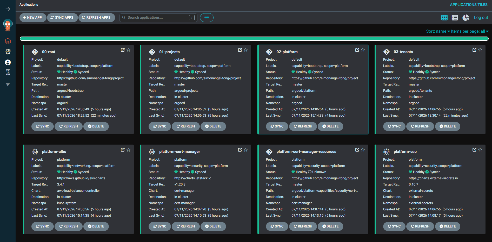

# Multi-tenant EKS Cluster

> A production-shape EKS cluster that hosts multiple teams on shared infrastructure. Terraform provisions AWS; ArgoCD runs everything above the API server via GitOps.

**AWS EKS · Terraform · ArgoCD · Karpenter · Istio (ambient) · AWS Load Balancer Controller · cert-manager · External Secrets · Kyverno**

---

## The Challenge

In a small to mid-size enterprise, giving every product team its own cluster drives up cost, slows onboarding, and leaves governance inconsistent.

> How to serve many teams from one cluster while keeping each team's workloads isolated, safe, and easy to operate?

This project creates a multi-tenant cluster on EKS: one namespace, one subdomain, and one deploy path per team, on top of shared compute, storage, ingress, TLS, DNS, and mTLS.

---

## Multi-tenant Cluster

A **multi-tenant cluster** is one Kubernetes cluster that hosts workloads from multiple teams, each isolated by namespace, network policy, and access controls.

Benefits:

- **Lower cost** — pooled capacity replaces per-team over-provisioning.
- **One platform to run** — one control plane, one upgrade path, one security baseline.
- **Consistent governance** — the same guardrails apply to every tenant.
- **Fast onboarding** — a new team goes live with one platform PR and one tenant PR.

---

## Capabilities

| Capability | Tooling                                           | What tenants get                                            |
| ---------- | ------------------------------------------------- | ----------------------------------------------------------- |
| Compute    | Karpenter + workload classes                      | On-demand nodes by class (`general`/`database`/`gpu`)       |
| Storage    | AWS EBS CSI + StorageClasses                      | PVCs on `gp3` (default) or `gp3-iops` (high-IOPS)           |
| Network    | Istio ambient + Gateway API + ALBC + external-dns | Public URL under `<team>.arguswatcher.net`, TLS, DNS, mTLS  |
| Security   | ESO + Pod Identity + cert-manager + Kyverno       | Secret vending, AWS access, wildcard TLS, admission control |

---

## Quick Start

```sh
# 1. Provision AWS
terraform -chdir=infra init -backend-config=backend.hcl
terraform -chdir=infra apply -auto-approve

# 2. Bootstrap the cluster
aws eks update-kubeconfig --region ca-central-1 --name multi-tenant-eks-dev
kubectl apply -f argocd/root.yaml

# 3. Access ArgoCD UI: https://localhost:8080
kubectl -n argocd port-forward svc/argocd-server 8080:443
```

- ArgoCD UI



---

## Demo Tenants

Two sample tenants exercise the full contract end-to-end.

### Team A — stateless

Simple nginx web app on `general` nodes, using

- compute
- ingress + TLS + DNS.

Manifests: [demo-app/team-a/](demo-app/team-a/)

- URL: `https://team-a.arguswatcher.net`


---

### Team B — stateful

Full-stack to-do app, using

- compute
- storage
- ingress + TLS + DNS.

Manifests: [demo-app/team-b/](demo-app/team-b/)

- URL: `https://team-b.arguswatcher.net`


---

## Documentation

**Platform runbooks**: how the platform team operates each capability.

- [Compute](docs/platform/compute.md)
- [Storage](docs/platform/storage.md)
- [Networking](docs/platform/networking.md)
- [Security](docs/platform/security.md)
- [Tenant onboarding](docs/platform/onboarding.md)

**Tenant guides**: how a team lands an application on the platform.

- [Onboarding](docs/tenant/onboarding.md)
- [Compute](docs/tenant/compute.md)
- [Network](docs/tenant/network.md)

---

## Roadmap

| Stage         | Scope                                                                                         | Status         |
| ------------- | --------------------------------------------------------------------------------------------- | -------------- |
| Foundation    | Compute, storage, networking, and security capabilities                                       | ✅ Done        |
| Observability | Multi-tenant monitoring, logging, and tracing on the LGTM stack (Loki, Grafana, Tempo, Mimir) | 🚧 In progress |
| Delivery      | Progressive rollouts and canary analysis via Argo Rollouts                                    | 🚧 In progress |
| Advanced      | GPU workloads and AI agent applications                                                       | 📋 Planned     |
