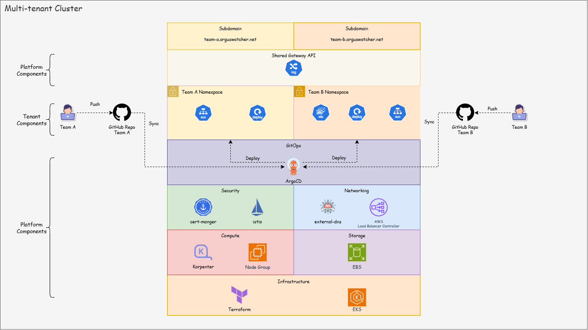
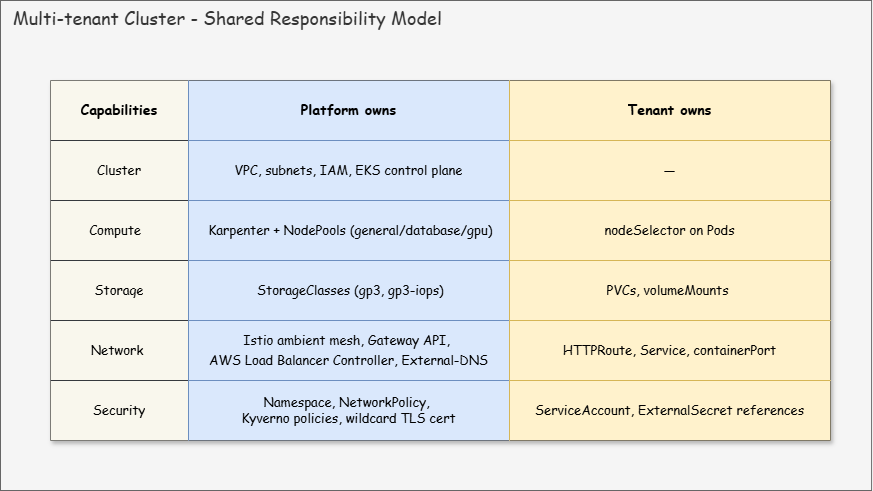

# Multi-tenant Cluster with EKS

> A multi-tenant EKS cluster that runs many teams on shared infrastructure. Terraform provisions AWS; ArgoCD runs everything above the API server via GitOps.

**AWS EKS · Terraform · ArgoCD · Karpenter · Istio (ambient) · AWS Load Balancer Controller · cert-manager · External Secrets · Kyverno**

- [Multi-tenant Cluster with EKS](#multi-tenant-cluster-with-eks)
  - [The Challenge](#the-challenge)
  - [The Multi-tenant Cluster](#the-multi-tenant-cluster)
  - [Architecture](#architecture)
  - [Quick Start](#quick-start)
  - [Onboarding Demo](#onboarding-demo)
    - [Stateless: Team A](#stateless-team-a)
    - [Stateful: Team B](#stateful-team-b)
  - [Limitations \& Roadmap](#limitations--roadmap)
  - [Documentation](#documentation)

---

## The Challenge

In a small or mid-size enterprise, giving every product team its own Kubernetes cluster drives up cost, slows onboarding, and leaves governance inconsistent.

> **How can one cluster serve many teams while keeping workloads isolated, secure, and easy to operate?**

---

## The Multi-tenant Cluster

This project answers the challenge with a **multi-tenant cluster on EKS** — a single Kubernetes cluster shared by multiple teams, with platform-owned guardrails and tenant-owned workloads.

**Why multi-tenant:**

- **Lower cost** — pooled capacity replaces per-team over-provisioning.
- **One platform to run** — one control plane, one upgrade path, one security baseline.
- **Consistent governance** — the same guardrails apply to every tenant.
- **Fast onboarding** — a new team goes live with one platform PR and one tenant PR.

**How the project delivers it** — four out-of-the-box capabilities:

| Capability | Tooling                                           | What tenants get                                            |
| ---------- | ------------------------------------------------- | ----------------------------------------------------------- |
| Compute    | Karpenter + workload classes                      | On-demand nodes by class (`general`/`database`/`gpu`)       |
| Storage    | AWS EBS CSI + StorageClasses                      | PVCs on `gp3` (default) or `gp3-iops` (high-IOPS)           |
| Network    | Istio ambient + Gateway API + ALBC + external-dns | Public URL under `<team>.arguswatcher.net`, TLS, DNS, mTLS  |
| Security   | ESO + Pod Identity + cert-manager + Kyverno       | Secret vending, AWS access, wildcard TLS, admission control |

---

## Architecture



- Terraform provisions the AWS foundation (VPC, EKS, IAM, Route53).
- ArgoCD then bootstraps everything above the API server:
  - 1. platform capabilities
  - 2. per-tenant AppProjects and ApplicationSets that sync each team's own manifest repo.



---

## Quick Start

**Prerequisites:**

- `terraform` ≥ 1.6, S3 remote backend
- `awscli` v2, AWS credentials with EKS/VPC/IAM permissions,
- `kubectl`,
- `Cloudflare` token and domain

```sh
# 1. Provision AWS
terraform -chdir=infra init -backend-config=backend.hcl
terraform -chdir=infra apply

# 2. Bootstrap the cluster
#    app-of-apps.yaml points ArgoCD at this repo's argocd/bootstrap tree,
#    which fans out into every platform capability and tenant.
aws eks update-kubeconfig --region ca-central-1 --name multi-tenant-eks-dev
kubectl apply -f app-of-apps.yaml

# 3. Access ArgoCD UI: https://localhost:8080
kubectl -n argocd port-forward svc/argocd-server 8080:443
```

- ArgoCD UI


---

## Onboarding Demo

Onboarding a new team takes **3 pieces of info and 1 JSON file**.

- **Tenant provides:** `team_name`, `repo_url`, `manifest_path`
- **Platform engineer commits:** `<team_name>.json` at the repo root — e.g. [team-a.json](./tenants/team-a.json):

```json
{
  "name": "team-a",
  "sourceRepo": "https://github.com/simonangel-fong/eks-multi-tenant-cluster",
  "manifestPath": "demo-app/team-a"
}
```

- **GitOps handles the rest** — namespace, AppProject, ApplicationSet, subdomain, TLS, and policy.
- **Public URL:** `https://<team_name>.arguswatcher.net`
- **Time to live URL:**
  - ~3 minutes for a stateless app,
  - ~2 additional minutes for a stateful app (PVC + database class node).

---

### Stateless: Team A

- **Application:** simple nginx web app, plain Kubernetes manifests ([demo-app/team-a/](demo-app/team-a/))
- **Node class:** `general` — see [docs/tenant/compute.md](docs/tenant/compute.md) for the nodeSelector pattern.
- **URL:** `https://team-a.arguswatcher.net`


---

### Stateful: Team B

- **Application:** full-stack to-do app, Helm chart ([demo-app/team-b/](demo-app/team-b/))
- **Node classes:** `general` (frontend, backend) · `database` (database) — see [docs/tenant/compute.md](docs/tenant/compute.md) for the nodeSelector pattern.
- **URL:** `https://team-b.arguswatcher.net`


---

## Limitations & Roadmap

**Scope:** targeted at small and mid-size enterprises with a handful of product teams.

**Known limitations:**

- **Self-service UI** — out of scope; onboarding is GitOps-driven via a JSON file.
- **Observability** — multi-tenant monitoring, logging, and tracing are still in progress.
- **Single region, single cluster** — no multi-region failover or cross-region DR.
- **Cost showback** — the _lower cost_ benefit is architectural, not measured; per-tenant chargeback dashboards are not shipped.

**Roadmap:**

| Stage         | Scope                                                                                         | Status         |
| ------------- | --------------------------------------------------------------------------------------------- | -------------- |
| Foundation    | Compute, storage, networking, and security capabilities                                       | ✅ Done        |
| Observability | Multi-tenant monitoring, logging, and tracing on the LGTM stack (Loki, Grafana, Tempo, Mimir) | 🚧 In progress |
| Advanced      | GPU workloads and AI agent applications                                                       | 📋 Planned     |

---

## Documentation

**Tenant guides** — read to onboard an app.

- [Onboarding](docs/tenant/onboarding.md)
- [Compute](docs/tenant/compute.md)
- [Network](docs/tenant/network.md)

**Platform runbooks** — read to operate a live cluster.

- [Compute](docs/platform/compute.md)
- [Storage](docs/platform/storage.md)
- [Networking](docs/platform/networking.md)
- [Security](docs/platform/security.md)
- [Onboarding a tenant](docs/platform/onboarding.md)

**Design & implementation** — read to understand how the project is built.

- [IaC with Terraform](docs/dev/01-infra.md)
- [GitOps with ArgoCD](docs/dev/02-argocd.md)
- [Capabilities](docs/dev/03-capabilities.md)

---
