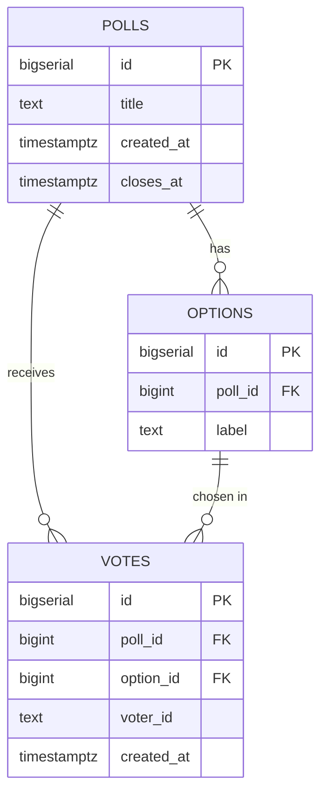

# data model

## Database Design

### ERD



---

### `polls`

| Field        | Type          | Description                                     |
| ------------ | ------------- | ----------------------------------------------- |
| `id`         | `BIGSERIAL`   | Primary key.                                    |
| `title`      | `TEXT`        | Poll question. `NOT NULL`.                      |
| `created_at` | `TIMESTAMPTZ` | Creation time. `NOT NULL`, defaults to `NOW()`. |
| `closes_at`  | `TIMESTAMPTZ` | Optional close time; `NULL` means never closes. |

- **Constraints**
  - `PRIMARY KEY (id)`.
- **Indexes**
  - Primary key index on `id` (implicit).

---

### `options`

| Field     | Type        | Description                                                        |
| --------- | ----------- | ------------------------------------------------------------------ |
| `id`      | `BIGSERIAL` | Primary key.                                                       |
| `poll_id` | `BIGINT`    | Owning poll. `NOT NULL`, `REFERENCES polls(id) ON DELETE CASCADE`. |
| `label`   | `TEXT`      | Choice text shown to voters. `NOT NULL`.                           |

- **Constraints**
  - `PRIMARY KEY (id)`.
  - `FOREIGN KEY (poll_id) REFERENCES polls(id) ON DELETE CASCADE`.
- **Indexes**
  - `idx_options_poll_id` on `(poll_id)` — fast lookup of a poll's options.

---

### `votes`

| Field        | Type          | Description                                                                                              |
| ------------ | ------------- | -------------------------------------------------------------------------------------------------------- |
| `id`         | `BIGSERIAL`   | Primary key.                                                                                             |
| `poll_id`    | `BIGINT`      | Poll being voted on. `NOT NULL`, `REFERENCES polls(id) ON DELETE CASCADE`.                               |
| `option_id`  | `BIGINT`      | Chosen option. `NOT NULL`, `REFERENCES options(id) ON DELETE CASCADE`.                                   |
| `voter_id`   | `TEXT`        | Free-form voter identifier. `NOT NULL`. Populated today from `X-User-Id`; will hold Cognito `sub` later. |
| `created_at` | `TIMESTAMPTZ` | Vote time. `NOT NULL`, defaults to `NOW()`.                                                              |

- **Constraints**
  - `PRIMARY KEY (id)`.
  - `FOREIGN KEY (poll_id) REFERENCES polls(id) ON DELETE CASCADE`.
  - `FOREIGN KEY (option_id) REFERENCES options(id) ON DELETE CASCADE`.
  - `UNIQUE (poll_id, voter_id)` as `uq_votes_poll_voter` — one vote per voter per poll.
- **Indexes**
  - `idx_votes_poll_option` on `(poll_id, option_id)` — supports the tally query (`GROUP BY poll_id, option_id`).

---

### Relationships

- `polls` **1—N** `options` — a poll has many options; deleting a poll cascades.
- `polls` **1—N** `votes` — a poll collects many votes; deleting a poll cascades.
- `options` **1—N** `votes` — an option can be picked by many voters; deleting an option cascades.

---

### Design notes

- `option_id` in `votes` is redundant with `poll_id` (an option already belongs to a poll), but keeping both lets the tally query stay a single `GROUP BY` and the FK guarantees consistency.
- `closes_at` is nullable — a null poll never closes; app logic decides whether to accept votes based on this.
- `voter_id` is `TEXT` rather than a FK — no `users` table yet; deferred until real auth (Cognito) is introduced.

---

## Sample data

Seeded by Flyway migration `V2__seed_sample_polls.sql` — runs after `V1` on every fresh database, so any environment (docker compose, CI, EKS via Helm) comes up pre-populated.

**Polls**

| id  | title                            |
| --- | -------------------------------- |
| 1   | Favorite programming language?   |
| 2   | Best cloud provider?             |

**Options & votes**

| poll | option     | votes |
| ---- | ---------- | ----- |
| 1    | Python     | 3     |
| 1    | Go         | 3     |
| 1    | TypeScript | 2     |
| 1    | Rust       | 2     |
| 2    | AWS        | 4     |
| 2    | Azure      | 3     |
| 2    | GCP        | 3     |

Voters use synthetic ids `voter-01` … `voter-20` — each id votes in at most one poll to satisfy `uq_votes_poll_voter`. The migration ends with `setval(...)` on the `polls` and `options` sequences so app-created rows start at id 3 / id 8 and won't collide with the seed.

---

## Development

```sh
# spin up containers
docker compose up -d

# wait until healthy, then open psql
docker exec -it voting-postgres psql -U voting -d voting

## verify
# show seeded sample data (2 polls, 20 votes)
docker exec -i voting-postgres psql -U voting -d voting -c "
  SELECT p.title, o.label, COUNT(v.id) AS votes
  FROM polls p
  JOIN options o ON o.poll_id = p.id
  LEFT JOIN votes v ON v.option_id = o.id
  GROUP BY p.id, p.title, o.id, o.label
  ORDER BY p.id, o.id;"
#              title              |   label    | votes
# --------------------------------+------------+-------
#  Favorite programming language? | Python     |     3
#  Favorite programming language? | Go         |     3
#  Favorite programming language? | TypeScript |     2
#  Favorite programming language? | Rust       |     2
#  Best cloud provider?           | AWS        |     4
#  Best cloud provider?           | Azure      |     3
#  Best cloud provider?           | GCP        |     3
# (7 rows)

docker compose down -v
docker compose up -d
```
