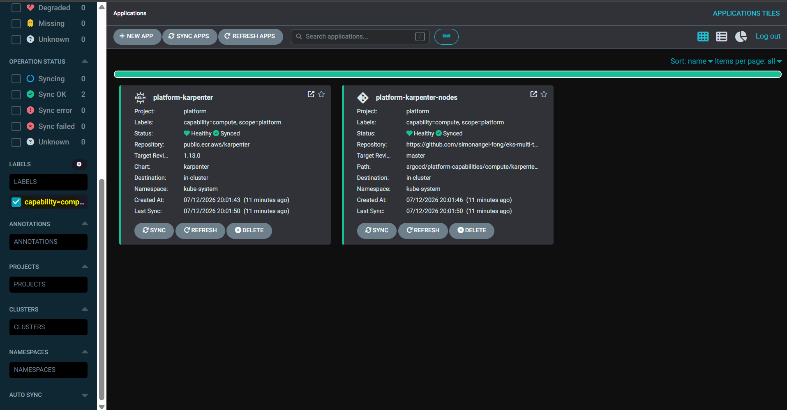
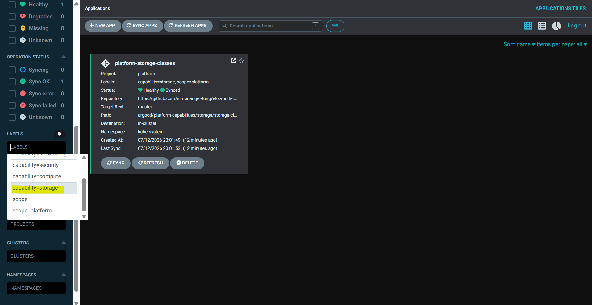

# Multi-tenant Platform Runbook - Capabilities

[Back](../README.md)

- [Multi-tenant Platform Runbook - Capabilities](#multi-tenant-platform-runbook---capabilities)
  - [Compute](#compute)
  - [Storage](#storage)
  - [Networking](#networking)
  - [Security](#security)

---

## Compute

```sh
kubectl get nodepool
# NAME       NODECLASS   NODES   READY   AGE
# database   database    0       True    17m
# general    general     1       True    17m
# gpu        gpu         0       True    17m

kubectl get ec2nodeclass
# NAME       READY   AGE
# database   True    17m
# general    True    17m
# gpu        True    17m

kubectl get nodeclaim
# NAME            TYPE        CAPACITY    ZONE            NODE                                           READY   AGE
# general-jdtxw   m5a.large   on-demand   ca-central-1b   ip-10-0-11-205.ca-central-1.compute.internal   True    17m

kubectl get nodes -L workload-class,karpenter.sh/nodepool,node.kubernetes.io/instance-type
# NAME                                           STATUS   ROLES    AGE   VERSION               WORKLOAD-CLASS   NODEPOOL   INSTANCE-TYPE
# ip-10-0-10-139.ca-central-1.compute.internal   Ready    <none>   32m   v1.36.2-eks-8f14419   platform                    t3.medium
# ip-10-0-11-205.ca-central-1.compute.internal   Ready    <none>   17m   v1.36.2-eks-8f14419   general          general    m5a.large
# ip-10-0-11-99.ca-central-1.compute.internal    Ready    <none>   32m   v1.36.2-eks-8f14419   platform                    t3.medium
```



---

## Storage

```sh
kubectl get storageclass
# NAME            PROVISIONER             RECLAIMPOLICY   VOLUMEBINDINGMODE      ALLOWVOLUMEEXPANSION   AGE
# gp2             kubernetes.io/aws-ebs   Delete          WaitForFirstConsumer   false                  35m
# gp3 (default)   ebs.csi.aws.com         Delete          WaitForFirstConsumer   true                   19m
# gp3-iops        ebs.csi.aws.com         Retain          WaitForFirstConsumer   true                   19m

```



---

## Networking

```sh
kubectl get gateway,httproute -A
NAMESPACE       NAME                                              CLASS   ADDRESS                                                                PROGRAMMED   AGE
istio-ingress   gateway.gateway.networking.k8s.io/istio-ingress   istio   multi-tenant-eks-dev-1d7dce920110640c.elb.ca-central-1.amazonaws.com   True         15m
```

---

## Security

```sh

```
