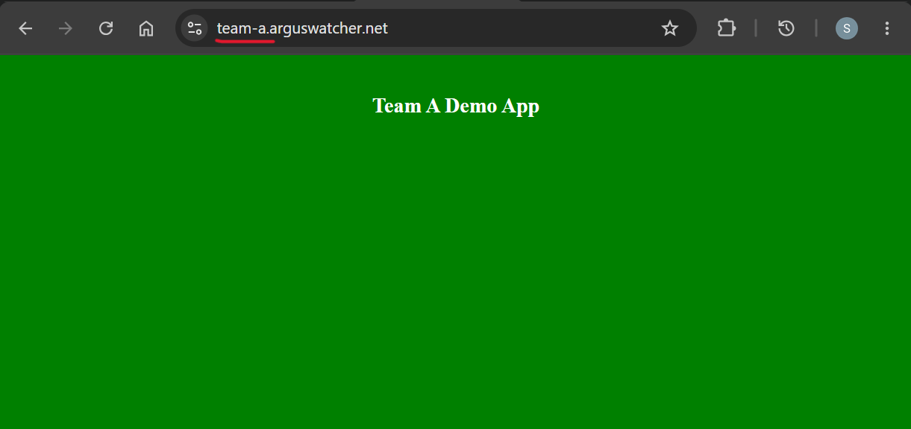
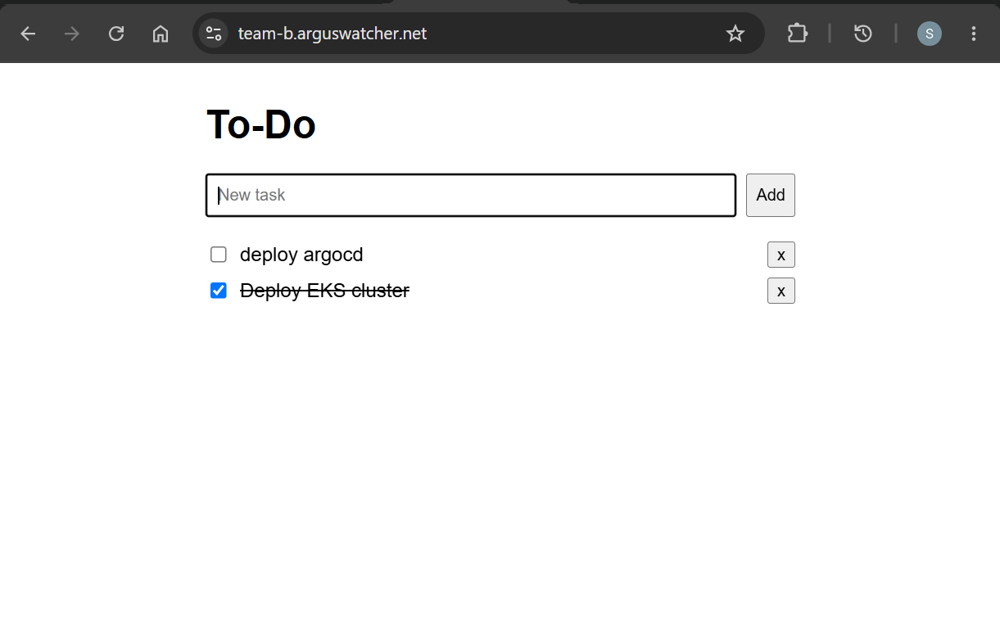

# Multi-tenant Platform Document - Onboarding

[Back](../../README.md)

- [Multi-tenant Platform Document - Onboarding](#multi-tenant-platform-document---onboarding)
  - [Onboarding](#onboarding)
  - [Demo - Team A](#demo---team-a)
  - [Demo - Team B](#demo---team-b)

---

## Onboarding

**Tenant inputs**

1. Team name (`<team>`) — used as namespace, subdomain, and `team` label.
2. Git repo containing the tenant manifests below.

**Tenant manifests**

- `Deployment` / `StatefulSet` with the `team` label, `resources` requests/limits, and probes.
- `PVC` (if stateful) referencing `gp3` or `gp3-iops`.
- `Service` fronting the pods.
- `HTTPRoute` attached to `istio-ingress/istio-ingress`, hostname under `<team>.arguswatcher.net`.

---

## Demo - Team A

**Profile.** Simple stateless web app. Default path only — no PVC, no toleration, one hostname.

**Capabilities exercised**

- compute (`general`)
- ingress + TLS + DNS

**Application**

- stateless nginx serving a custom `index.html` mounted from a `ConfigMap`
- host: `team-a.arguswatcher.net`
- manifests: [`demo-app/team-a`](../../demo-app/team-a)

---

## Demo - Team B

**Profile.** Full-stack to-do app: web tier (stateless) + Postgres (stateful, PVC). Exercises two node classes and high-IOPS block storage.

**Capabilities exercised**

- compute (`general` + `database`)
- storage (`gp3-iops`, `Retain`)
- ingress + TLS + DNS

**Application**

- full-stack to-do app; web tier stateless, Postgres backed by a `gp3-iops` PVC
- host: `team-b.arguswatcher.net`
- manifests: [`demo-app/team-b`](../../demo-app/team-b)

